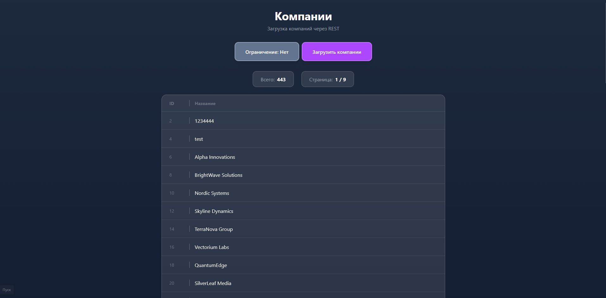

# Bitrix24 Companies Viewer

Приложение Node.js + Vue.js для получения и отображения компаний из Bitrix24 через REST API.


### 1. Настройка сервера

```bash
cd server
npm install
```

Создайте файл `.env`:
```env
BITRIX24_WEBHOOK_URL=https://b24...
PORT=3001
```
```bash
npm run build
npm start
```
### 2. Настройка клиента

```bash
cd client
npm install
npm run build
npm run preview
```


## Скриншот

